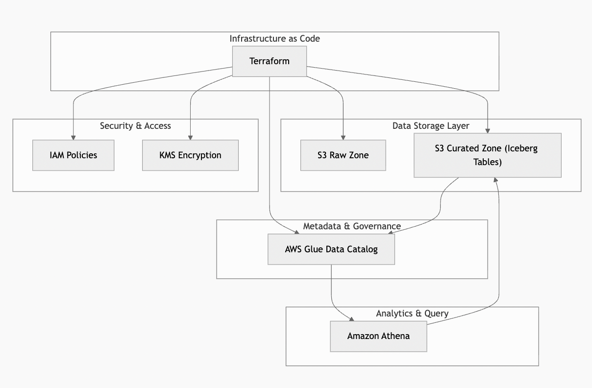

# Implementing a Transactional Data Lakehouse with Apache Iceberg and Terraform

## Overview

In this project, I built a transactional data lakehouse on AWS using **Apache Iceberg** and **Terraform**.

The goal was straightforward: design a storage and analytics foundation that works well for today’s reporting and analytics needs, while remaining flexible enough to support machine learning and GenAI workloads in the future — without locking into a single vendor or tightly coupled platform.

This is not a demo or “learning-only” project. It’s structured the way I would build the foundation of a real data platform in an enterprise environment.

---

## High-Level Architecture

flowchart TB

%% Infrastructure as Code
subgraph IaC["Infrastructure as Code"]
    TF[Terraform]
end

%% Storage Layer
subgraph Storage["Data Storage Layer"]
    S3Raw["S3 Raw Zone"]
    S3Curated["S3 Curated Zone (Iceberg Tables)"]
end

%% Metadata Layer
subgraph Metadata["Metadata & Governance"]
    Glue["AWS Glue Data Catalog"]
end

%% Query Layer
subgraph Query["Analytics & Query"]
    Athena["Amazon Athena"]
end

%% Security Layer
subgraph Security["Security & Access"]
    IAM["IAM Policies"]
    KMS["KMS Encryption"]
end

%% Relationships
TF --> S3Raw
TF --> S3Curated
TF --> Glue
TF --> IAM
TF --> KMS

S3Curated --> Glue
Glue --> Athena
Athena --> S3Curated

---

## Why Apache Iceberg

I chose **Apache Iceberg** instead of formats like Delta Lake or plain Parquet for several reasons:

- I wanted an **open table format** that avoids vendor lock-in.
- Iceberg works across multiple engines (Athena today, Spark or Trino later).
- It supports **ACID transactions**, which is critical for concurrent reads and writes.
- Schema changes can be applied without rewriting entire datasets.
- Built-in **time travel** makes debugging, auditing, and rollback much easier.

For modern analytics platforms — especially those feeding downstream AI or ML systems — these capabilities are far more important than simply storing files in S3.

---

## Why Amazon Athena

Athena was a deliberate choice for the initial query layer.

- It’s fully serverless, so there’s no infrastructure to manage.
- You pay only for the queries you run.
- It integrates cleanly with Iceberg and the Glue Data Catalog.
- It’s well-suited for ad-hoc analytics, BI queries, and feature exploration.

If future workloads require heavier transformations or sustained compute, this architecture can be extended with Spark or EMR without changing the underlying storage design.

---

## Why Terraform

All infrastructure in this project is provisioned using **Terraform**.

This makes the platform:
- Reproducible across environments
- Auditable and version-controlled
- Easy to extend as requirements evolve

Terraform is intentionally used only for **infrastructure components**, not data definitions.

---

## Iceberg Table Management

Iceberg tables are created using **Amazon Athena DDL**, rather than Terraform.

This is an intentional design decision. Iceberg tables must be created by an Iceberg-aware engine in order to generate the required metadata (snapshots, manifests, and version history). Terraform can register Glue tables, but it cannot create valid Iceberg metadata on its own.

Terraform manages:
- S3 buckets and folder structure
- Glue Data Catalog databases
- Security and encryption settings

Athena manages:
- Iceberg table creation
- Schema evolution
- Inserts and updates
- Time travel queries

### Features Demonstrated
- Apache Iceberg table creation using Athena
- Schema evolution without table rewrites
- Time travel queries using Iceberg snapshots
- Serverless querying via Amazon Athena

---

## Cost Management

To keep costs predictable and low:

- Athena is used instead of always-on clusters
- Query results are stored in a dedicated S3 prefix
- S3 is used as the primary storage layer
- The design avoids unnecessary data duplication
- The platform can be monitored using AWS Budgets and cost reports

This makes the setup suitable for experimentation without unexpected spend.

---

## Project Structure

diagrams/project-structure.png

## Repository Structure

The repository is organized to clearly separate infrastructure provisioning,
data definition, and documentation. This structure mirrors how production data
platforms are typically managed in enterprise environments.

---

## What This Project Demonstrates

This project demonstrates how to design and implement:

- A modern, open lakehouse architecture
- Transactional analytics on S3 using Iceberg
- Clean separation between infrastructure and data lifecycle
- A foundation that can evolve toward ML and GenAI use cases

